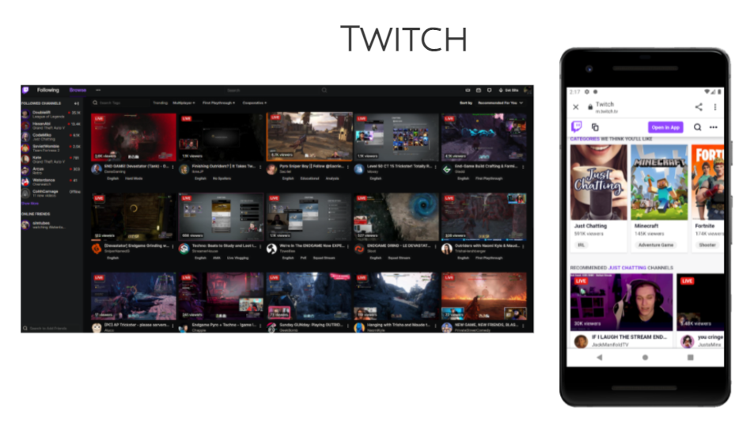
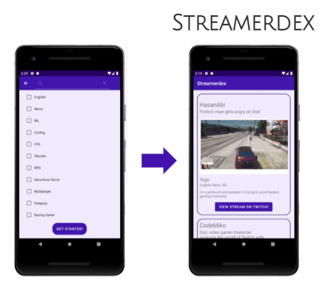

# Streamerdex
Discover your new favourite streamer with Streamerdex! This student project was made in the Mobile Development with Android Technologies course at BCIT Computing.
Lovingly brought to you by Blake, Chloe, and Janelle. 💜

## The Problem
Twitch is a streaming platform that allows fans to watch and interact with content creators live, such as gaming and podcasts.
The native Twitch platform has limited functionality for discovering new streamers, so many viewers find streamers through existing communities 
on other platforms or browsing by popularity on the site’s page.

## Our Solution
We developed a concept for a Twitch companion app that helps users discover new streams based on their preferences.
A viewer would be able to select topics of interest and browse content matching those topics, that would then link back to the full Twitch page.
This allows for greater discoverability of new channels and content, especially smaller or less popular creators.
We designed Streamerdex to be small and simple to use, intending to catch viewers’ eyes with easy to digest “cards” of information.
Since we were unable to access the official Twitch API, we used mock data in Firebase for this MVP.

